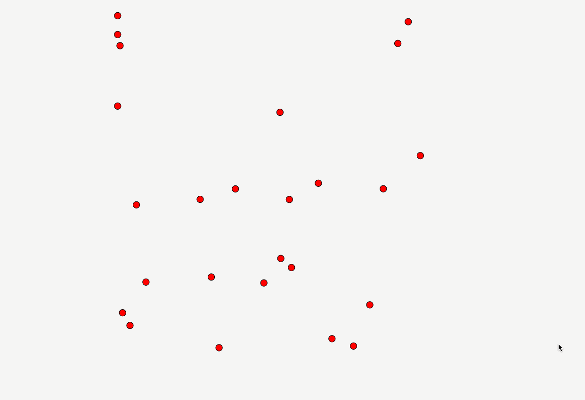

# OLSR Random mobility simulation
This is a [OLSR](https://datatracker.ietf.org/doc/html/rfc3626) protocol simulation on [ns3](https://www.nsnam.org/). The nodes move on a 2d space and interact with each other as per OLSR specification.

## Get started
### Prequisites
* ns3 installed
* python3 pyviz installed

### Running the simulation
First you need to copy this simulation into ns3 scratch folder.

```sh
cp olsr-random-mobility.cc $NSR_INSTALLATION_FOLDER/scratch

./waf --run "scratch/olsr-random-mobility --sides=5 --mobilityStatic=false" --vis
```

### For macOS users:
Please make sure you install all the pyviz dependencies with `brew`.

### Preview

